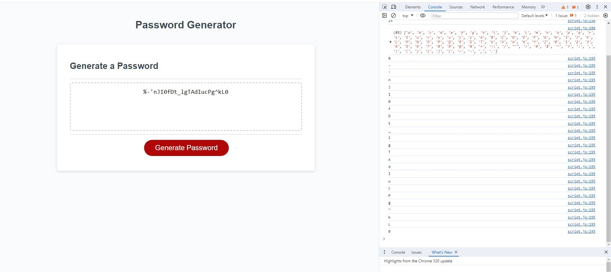
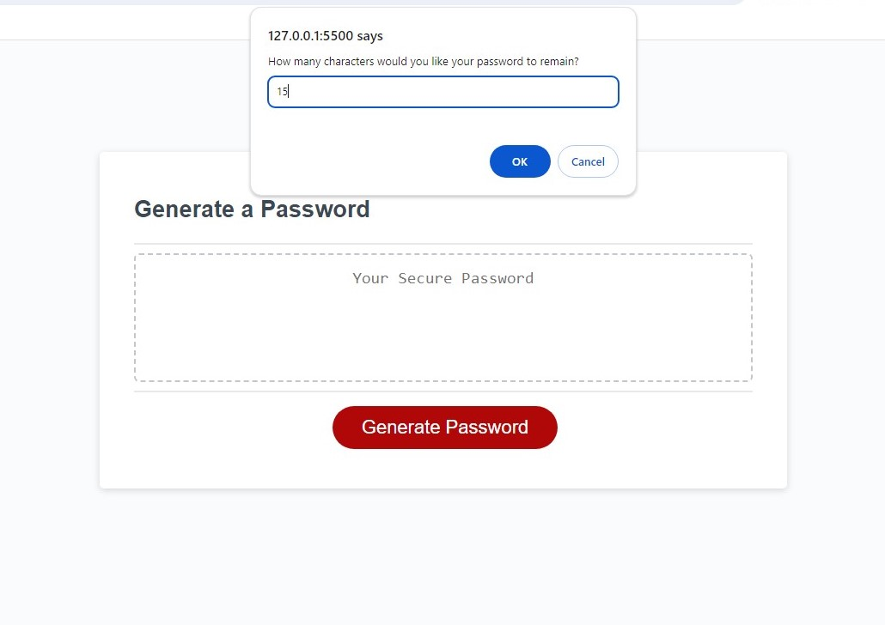
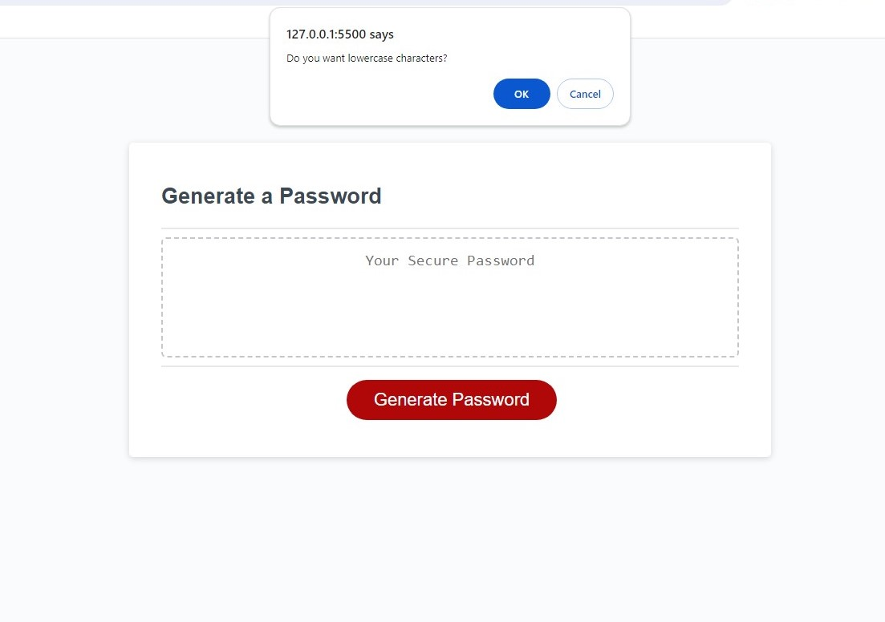
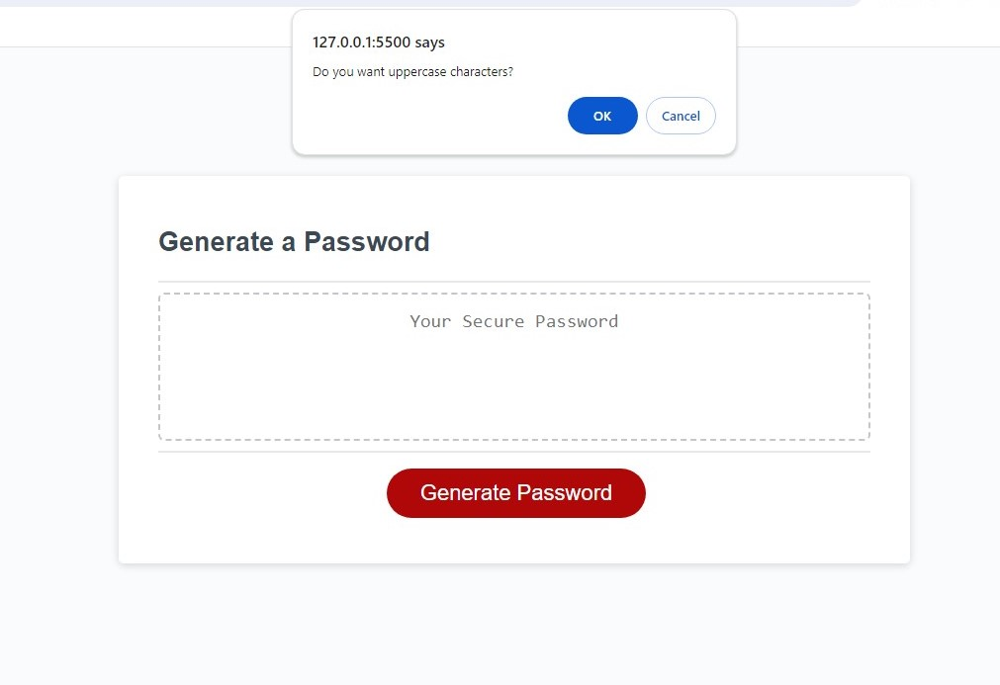
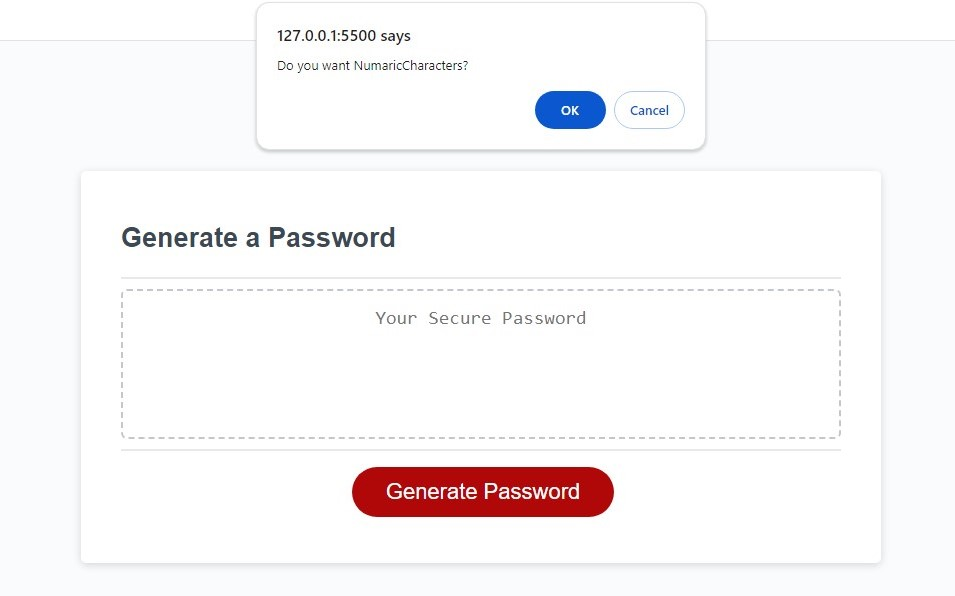
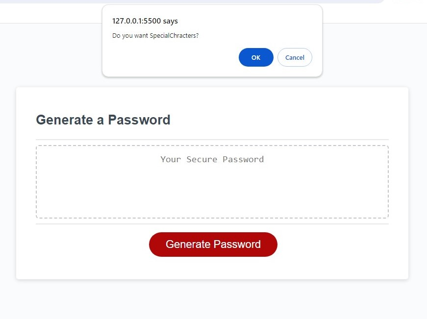
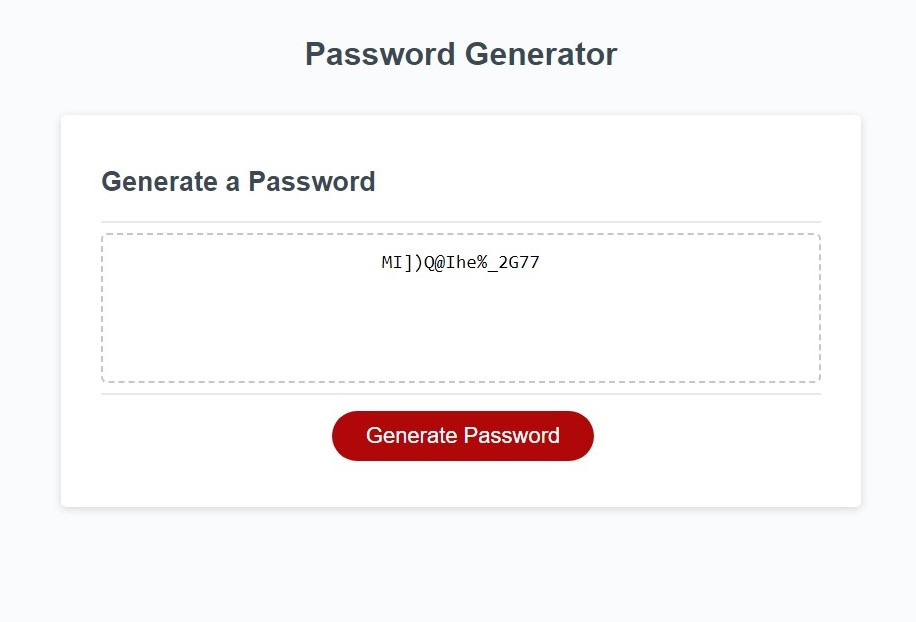

Title:

Password-Generator

Description:

I have made this project to control access into any file, folder, document, website and any kind of software system, etc. 
By generating a password randomly anyone can ensure their document's safety and security.

Acceptance criteria:

.Generate a password when the button is clicked
.Present a series of prompts for password criteria
.Length of password
.At least 8 characters but no more than 128.
.Character types
.Lowercase
.Uppercase
.Numeric
.Special characters ($@%&*# etc)
.Code should validate for each input and at least one character type should be selected
.Once prompts are answered then the password should be generated and displayed in an   alert or written to the page.

Table of Contents: 
.Title
.Description
.Users Story
.Acceptance Criteria
.Features
.Screenshots
.Credits
.License

Users Story

Screenshots:

A screenshots with console:

How many characters would you like your password to remain? Answer:15

Lowercase Characters:

Uppercase Characters:

Numaric Characters:

Special Characters:

A password has generated here:

